# 前端 UI 图

本文展示前端单页应用的页面结构和主界面关系。当前前端没有独立路由，主要由 App.vue 通过 currentPage 在几个核心页面之间切换。

## 页面切换图

## 页面结构图

## 页面清单

| 页面 | 作用 | 主要交互 |
| --- | --- | --- |
| 申请列表页 | 查看全部申请并进入后续操作 | 搜索、查看详情、编辑、审查、删除 |
| 新建或编辑申请页 | 录入申请信息和附件 | 表单提交、附件上传、取消编辑 |
| 审核结果页 | 展示 AI 初审结论 | 启动审核、重新审核、查看建议 |
| 申请详情页 | 查看申请完整信息和历史审核情况 | 查看附件、阅读审核说明 |
| 知识库管理页 | 管理向量知识库 | 上传解析、语义检索、维护知识记录 |
