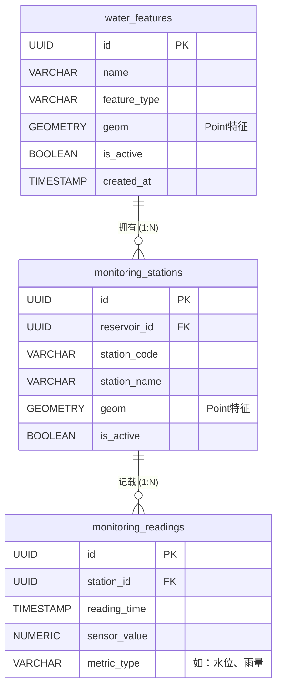

# 系统设计文档说明书

## 1. 设计概述
### 1.1 设计目标
基于《需求规格说明书》，完成小型水库安全监测与预警系统技术方案设计，指导开发实施，确保体系架构健壮、性能优良且安全合规。

### 1.2 设计范围
包含系统总架构、PostGIS数据库结构、基于业务领域的模块设计、RESTful API设计与空间处理流程设计。

### 1.3 规范符合性声明
1. 项目架构与目录结构：遵循规范第3章
2. 数据库设计：遵循规范第5章
3. 空间数据处理：遵循规范第6章
4. API接口设计：遵循规范第7章
5. 安全设计：遵循规范第10章

## 2. 系统总体架构设计
### 2.1 整体分层架构
* **访问层：** Vue.js/React 开发的前端页面。
* **API层：** FastAPI/Flask提供路由分发、中间件（日志、CORS、限流）。
* **服务层：** 水库业务逻辑、预警判断逻辑、空间分析引擎（GeoTools或自处理）。
* **数据访问层：** SQLAlchemy ORM映射及原生SQL封装。
* **数据存储层：** PostgreSQL+PostGIS，Redis用于会话缓存。

### 2.2 工程目录结构设计
```
backend/
├── api/          # 接口路由层
├── core/         # 核心配置、异常处理、安全中间件
├── modules/      # 业务领域模块（如水库管理、监测预警、GIS）
├── services/     # 业务逻辑服务
├── models/       # 数据库模型
├── schemas/      # Pydantic或序列化类
├── utils/        # 通用工具（空间转换等）
└── tests/        # 单元测试
```

## 3. 数据库设计
### 3.1 数据库选型
采用 PostgreSQL + PostGIS，因其提供强大的地理空间存储与计算分析能力，符合规范选型。

### 3.2 核心表结构设计
1. **水利要素主表 (water_features)**
   * `id`: UUID (PK)
   * `name`: VARCHAR
   * `feature_type`: VARCHAR
   * `geom`: GEOMETRY(Point/Polygon, 4326)
   * `is_active`: BOOLEAN
   * `created_at`, `updated_at`: TIMESTAMP

2. **监测站点表 (monitoring_stations)**
   * `id`: UUID (PK)
   * `reservoir_id`: UUID (FK)
   * `station_code`: VARCHAR
   * `geom`: GEOMETRY(Point, 4326)

3. **时序监测数据表 (monitoring_readings)**
   * (采用按月分区表设计)
   * `station_id`: UUID
   * `reading_time`: TIMESTAMP
   * `sensor_value`: NUMERIC
   * `metric_type`: VARCHAR

### 3.3 数据库ER图与关联关系
根据课程规范5.3的逻辑要求，核心业务表之间的关联关系如下：



**关联关系说明：**
* **水利要素表 (`water_features`) 与 监测站点表 (`monitoring_stations`)：** 【一对多 (1:N)】。一个水库（水利要素）可以拥有多个监测子站，例如一个水库可以布置一个水位站和多个降雨量站，它们通过 `reservoir_id` 将站点挂载在特定水库上。
* **监测站点表 (`monitoring_stations`) 与 监测数据表 (`monitoring_readings`)：** 【一对多 (1:N)】。一个监测站点随着时间的推移，会采集生成无数条时间序列的监测数据，它们通过 `station_id` 进行关联。

### 3.4 空间数据存储设计
* **坐标系：** WGS 84 (EPSG:4326)。
* **空间索引：** `CREATE INDEX idx_water_feat_geom ON water_features USING GIST (geom);`

## 4. 核心功能模块详细设计
### 4.1 GIS 空间分析模块
1. **数据导入设计：** 
   文件上传 -> 格式解析(Shapefile/GeoJSON) -> CRS转换 (强制转EPSG:4326) -> 几何合法性校验(ST_IsValid) -> 数据入库。
2. **核心分析：** 
   * 缓冲区计算调用 `ST_Buffer(geom::geography, radius)`，并转回Geometry。
3. **坐标系转换：** `ST_Transform(geom, 3857)` 用于发给前端地图渲染。

## 5. API 接口设计
### 5.1 通用规范
遵循 `/api/v1/{resources}`。

### 5.2 核心接口明细
| 接口地址 | HTTP 方法 | 接口说明 | 请求参数 | 响应结构 | 权限 |
| --- | --- | --- | --- | --- | --- |
| `/api/v1/reservoirs` | GET | 查询水库列表及位置 | `?bbox=...` | `FeatureCollection` | 业务管理员 |
| `/api/v1/readings` | POST | 上报监测数据 | Body含设备ID及数值 | JSON成功信息 | 巡检系统 |
| `/api/v1/spatial/buffer` | GET | 水库溃坝缓冲区 | `?id=&distance=` | `Polygon` GeoJSON | 业务管理员 |

## 6. 安全设计
### 6.1 认证授权设计
* **认证：** JWT Token 机制。
* **会话：** Token 有效期 2 小时，利用 Redis 防重放与强制注销。

### 6.2 数据安全设计
* **脱敏：** 返回人员电话需使用中间打码脱敏。
* **备份：** 数据库设每日增量、每周全量备份脚本。

### 6.3 防护设计
* SQL预编译防SQL注入；启用中间件严格过滤XSS及CORS策略限制。
